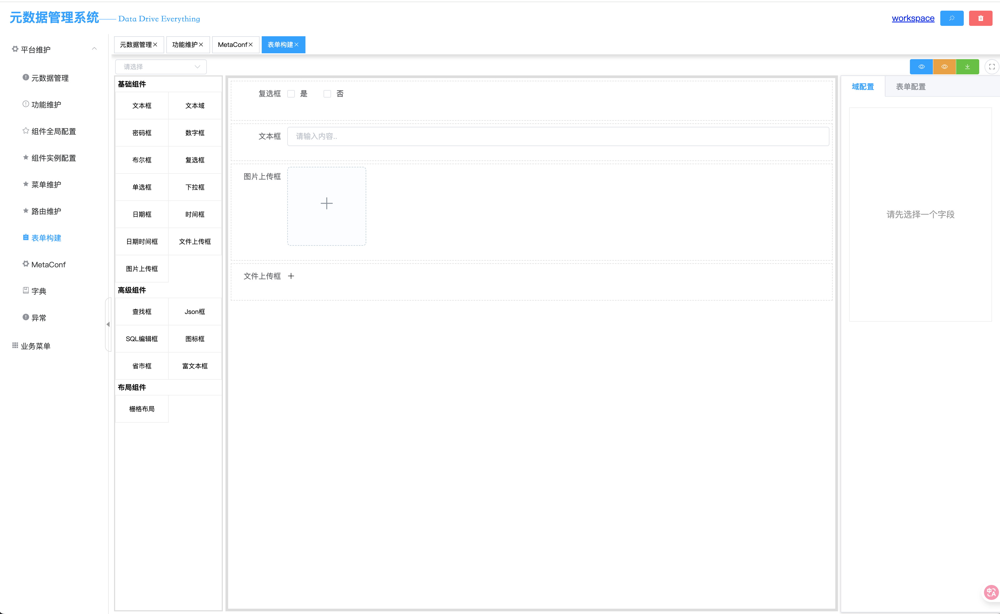

# DB MetaData Server
> Chinese Readme: [Readme_cn.md](Readme_cn.md) | 
> English Readme: [Readme.md](Readme.md)

> A rapid development framework based on database metadata. The abbreviation DBMS shares the same goal as the database DBMS (Database Management System), integrating basic business elements.
> For the definition of rapid development frameworks and platforms, it's a scaffold that integrates basic development tools and includes fundamental modules (RBAC permissions, menus, users, dictionaries, etc.).
> The original intention of these frameworks is to allow developers to start developing business-related modules without having to build a complete system from scratch, extracting "common" modules as much as possible to achieve reusability.
>
> However, the current situation is that large projects or systems usually consist of many subsystems or submodules, and not every submodule needs complete user permissions, login, menu management, dictionary functions, etc.
> If you have limited personnel, a small project scale, and are starting from the 0->1 stage, choosing any open-source rapid development framework is appropriate. If the system is not in the 0->1 stage, already online with some features, the effectiveness and cost of introducing a rapid development framework are worth considering.
>
> DBMS is positioned first as a functional engine, and secondly as a development platform.
> 

### Technology Stack
- SpringBoot
- JFinal ActiveRecord
- MySQL 8.0 / Druid 
- JDK 17
- Guava
- FastJson

### What Can It Do
- Build a CRUD module with zero code, supporting tree tables, master-detail tables, and single table CRUD operations
- Form supports online graphical drag-and-drop configuration design
- Can serve as a pure backend providing data interfaces
- Can be used with both frontend and backend
- Can be used as a built-in module with SpringBoot support

### System Screenshots





## Quick Start
### Project Structure
```bash
├── db
├── db-metadata-analysis-springboot
├── db-metadata-parent
├── db-metadata-server-springboot
└── db-metadata-web
```
### Installation and Deployment
```shell
docker-compose up
```

- phpMyAdmin: `http://localhost:8000` Username: `root` Password: `root123` 
- System Frontend: `http://localhost` Complete initialization as shown in the figure; 
  - 

### Dependency Configuration
### Integration

## Basic Terminology
#### Meta Object
"Thinking in Java" begins with "Everything is an object", and in the Linux world "Everything is a file". In DBMS, it can be understood that everything revolves around "meta objects".
What is a meta object? "Metadata" is data that describes data, so a meta object is an object that describes objects. In a narrow sense, a meta object can represent a "table", "a view", or "a collection of field types".
In relational databases, meta objects can be constructed through DB metadata. In non-relational scenarios, they can be defined through flexible schemas.

#### Meta Field
Based on meta objects, meta fields describe the fields within objects, defining field attributes and page editing behaviors, such as field type, field length, whether the field is nullable, whether it's an index, whether it's a primary key, etc.
Page behaviors include form addition, modification state settings (read-only, write-only, read-write, dictionary auto-translation, and other common business support).

#### Component
Component abstraction is designed to serve frontend display layer configuration. Each component in a frontend framework can be abstracted as a component, with its own independent frontend settings.

```
- Data Display (ViewComponent)
    - Table Component (depends on meta object{1,n}) (TableView)
    - Form Component (depends on meta object{1,n}) (FormView)
    - Tree Component (depends on meta object{1,n}) (TreeView)
    - Search Component (depends on meta object{1,n})
- Form (FormView)
    - Radio Component (meta field) FormField
    - Checkbox Component (meta field)
    - Input Component (meta field)
    - Business Query Component
    - Switch Component (meta field)
    - Date Component (meta field)
    - Range Component (meta field)
    - Upload Component (meta field)
```
#### Component Instance
> Pure components have no soul; meta objects and meta fields are the data soul of components
> 
#### Template
What is a template? A template is an abstraction for scenarios, such as one-to-one CRUD, one-to-many CRUD, etc.
Templates need to include: frontend templates, backend template logic, input and output, and some foreseeable extensions.

#### Function
> What is defined as a function?
> A function can be a button + the logic behind it  
> A function can be pure backend logic  
> A function can be a page  
> Formula:
```
Function = (SearchBar(Component) + UIConfig + Meta Object) * n
Function = Table(Component) + UIConfig + Meta Object
Function = Function * n
```
### Design

#### Overall Architecture Diagram
> Hierarchical structure and relationships of meta objects, meta fields, components, and other concepts

#### Communication Diagram
> Frontend request rendering -> Backend data assembly -> Configuration loading -> merge
#### Database E-R Diagram

#### Meta Object - Class Diagram

#### Component - Class Diagram

#### Query Module

#### Extensions
> To better integrate with other systems, DBMS abstracts common modules with minimal interfaces to ensure sufficient flexibility
##### User System
> The user system can be developed as a large subsystem when extracted separately. In DBMS, users are abstracted to some extent

> Core interfaces: User (user entity interface), LoginService (login service), UserService (user query service), UserFactory (factory)

##### Permission System
> DBMS does not implement permission control modules like RBAC but provides extension interfaces

> Core permission interfaces in DBMS are MResource (resource), MRPermit (resource validator), MRLoader (resource loader)


### Core Data Structures

#### Various Configurations
- Meta object config
- Meta field config
- Global component config
- Component instance config
- Function config
> Configuration uses a global version number, referencing SVN, where the version number increments after any config change?

## Technical Debt
- To gain dynamic capabilities and quickly launch the first version, the system uses JSON storage for configurations at the bottom layer, leading to extensive use of Kv objects (Map) during upper-layer data transportation. When the call chain is too long, it's difficult to determine the internal data of the current Kv object, bringing costs and risks to code reading and debugging.
    > After data structure stabilization, use specific models to store key configurations
- Configuration information is stored in JSON fields in the database. While this ensures flexibility, it's not conducive to retrieval. MySQL 5.7 has limited support for JSON fields
- Meta object config, field config, component config, instance config - to achieve independence at each layer, different configurations with different purposes and meanings are set separately. When first encountering these, the cost of understanding these configuration information is too high, and configs lack structural validation, which may lead to useless and invalid dirty fields when features explode on a large scale

## RoadMap
- Server source code integration, separating db-metadata-server business logic from container-related logic, aiming to support other MVC frameworks at the upper layer
- Data permission design
    > Based on meta objects, combined with custom template script fragments, generate SQL with permission filtering content for data permissions
    ```
        Template fragments can have built-in objects like User, Group, Company
        Permission judgment might be:
        if(user.role.is('team leader'))
            return Query, Add, Update
        if(user.role.is('member'))
            return Query
        Viewing team data might be:
        if(user.role.is('team leader') && user.role.has(query))
            return create_by in GroupIds
        
    ```
- Enrich MResource implementations, add validation from different dimensions (meta object dimension, template dimension), control query permissions for the Query module
- Enrich database view support ViewMetaObject, add meta object property settings, referencing Linux file system drwxrwxrwx
- FormBuilder covering common templates
- JSON diff support
- Deep SpringBoot integration (fully managed datasource with Spring), full support for Spring-style creation of routers, controllers, interceptors, and other JFinal components
- Cache support for time-consuming operations (ehcache + redis)
- Version control for "functions" - since function rendering completely depends on data configuration, version control must be ensured after release. Currently, after meta object configuration updates, all upstream component configs are recalculated
- Currently, forms only support single meta objects; complex business scenarios may require simultaneous editing of multiple tables
- Improve support for Spring containers; currently only preliminary integration

##### Some References
- Do everything beneficial to "speed"
- Any problem in computer science can be solved by adding another layer of indirection
    > Any problem in computer science can be solved by another layer of indirection.  
     https://cloud.tencent.com/developer/article/1491973
- Eova, jeesite, jeecg-boot, Primeton
- Extjs, vue component
- APIJSON
- GraphQL 